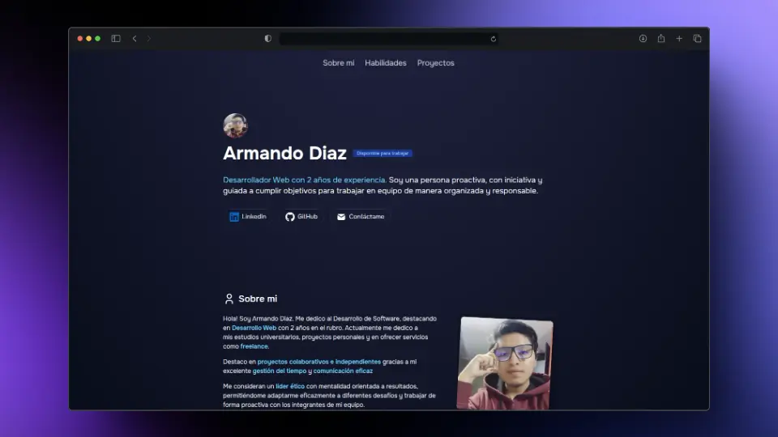

  <h3>MI PORTFOLIO PERSONAL</h3>  
  
  
Este es mi portfolio personal donde muestro mis proyectos y habilidades en desarrollo web. Explora mis trabajos y conoce más sobre mi experiencia y conocimientos.

## 🛠️ Herramientas

- [**Astro**](https://astro.build/) - El marco web para sitios web basados en content-driven.
- [**Typescript**](https://www.typescriptlang.org/) - JavaScript con sintaxis tipado.
- [**Tailwindcss**](https://tailwindcss.com/) - Un framework CSS que prioriza las utilidades para crear rápidamente diseños personalizados.
